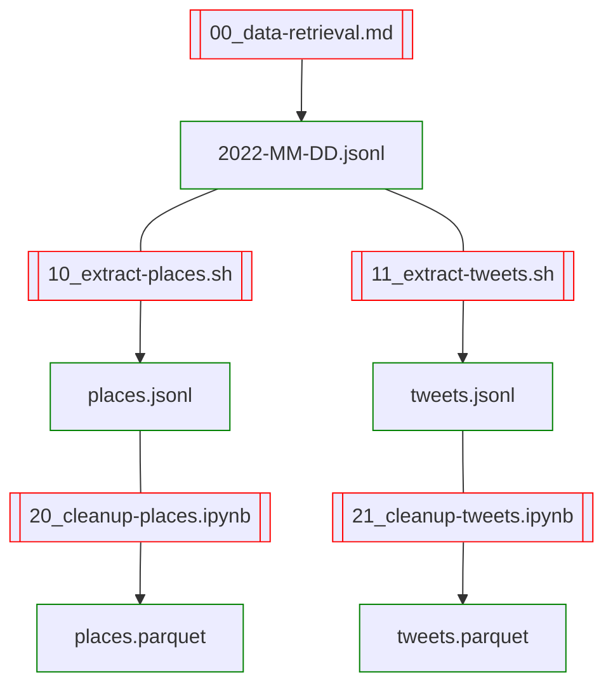

# breviloquia-italica

```mermaid
flowchart TD;

00[[00_data-retrieval.md]]:::code;
00 --> 2022-MM-DD.jsonl:::data;

10[[10_extract-places.sh]]:::code;
11[[11_extract-tweets.sh]]:::code;
2022-MM-DD.jsonl --- 10 --> places.jsonl:::data;
2022-MM-DD.jsonl --- 11 --> tweets.jsonl:::data;

20[[20_cleanup-places.ipynb]]:::code;
21[[21_cleanup-tweets.ipynb]]:::code;
places.jsonl --- 20 --> places.parquet:::data;
tweets.jsonl --- 21 --> tweets.parquet:::data;

classDef code stroke:red;
classDef data stroke:green;
```
