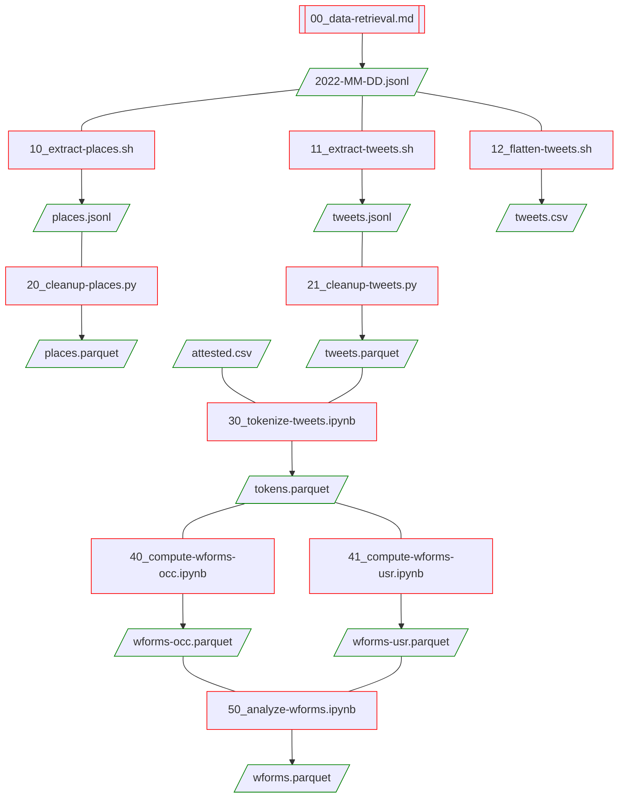

# breviloquia-italica

```mermaid
flowchart TD;

00[[00_data-retrieval.md]]:::code;
00 --> 2022-MM-DD.jsonl[/2022-MM-DD.jsonl/]:::data;

10[10_extract-places.sh]:::code;
11[11_extract-tweets.sh]:::code;
12[12_flatten-tweets.sh]:::code;
2022-MM-DD.jsonl --- 10 --> places.jsonl[/places.jsonl/]:::data;
2022-MM-DD.jsonl --- 11 --> tweets.jsonl[/tweets.jsonl/]:::data;
2022-MM-DD.jsonl --- 12 --> tweets.csv[/tweets.csv/]:::data;

20[20_cleanup-places.py]:::code;
21[21_cleanup-tweets.py]:::code;
places.jsonl --- 20 --> places.parquet[/places.parquet/]:::data;
tweets.jsonl --- 21 --> tweets.parquet[/tweets.parquet/]:::data;

30[30_tokenize-tweets.ipynb]:::code;
attested.csv[/attested.csv/]:::data --- 30;
tweets.parquet --- 30 --> tokens.parquet[/tokens.parquet/]:::data;

40[40_compute-wforms-occ.ipynb]:::code;
tokens.parquet --- 40 --> wforms-occ.parquet[/wforms-occ.parquet/]:::data;

41[41_compute-wforms-usr.ipynb]:::code;
tokens.parquet --- 41 --> wforms-usr.parquet[/wforms-usr.parquet/]:::data;

50[50_analyze-wforms.ipynb]:::code;
wforms-occ.parquet --- 50;
wforms-usr.parquet --- 50 --> wforms.parquet[/wforms.parquet/]:::data;

classDef code stroke:red;
classDef data stroke:green,shape:rectangle;
```
