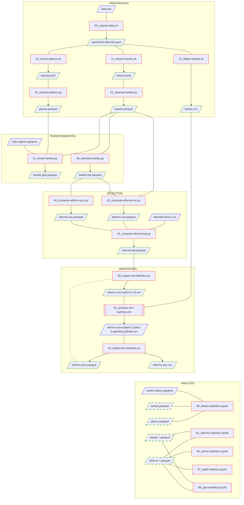

# breviloquia-italica-pipeline

```mermaid
flowchart TD;

subgraph P1 [PREPARATION]

00[00_unpack-data.sh]:::code;
10[10_extract-places.sh]:::code;
11[11_extract-tweets.sh]:::code;
12[12_flatten-tweets.sh]:::code;
20[20_cleanup-places.py]:::code;
21[21_cleanup-tweets.py]:::code;

2022-MM-DD.jsonl[/data/2022-MM-DD.jsonl/]:::data;
places.jsonl[/places.jsonl/]:::data;
places.parquet[/places.parquet/]:::data;
tweets.jsonl[/tweets.jsonl/]:::data;
tweets.parquet[/tweets.parquet/]:::data;
tweets.csv[/tweets.csv/]:::data;

data.zip[/data.zip/]:::extdata --- 00;
00 --> 2022-MM-DD.jsonl;

2022-MM-DD.jsonl --- 10 --> places.jsonl;
places.jsonl --- 20 --> places.parquet;

2022-MM-DD.jsonl --- 11 --> tweets.jsonl;
tweets.jsonl --- 21 --> tweets.parquet;

2022-MM-DD.jsonl --- 12 ----> tweets.csv;

end

subgraph P2 [TRANSFORMATION]

30[30_tokenize-tweets.py]:::code;
31[31_locate-tweets.py]:::code;

tweets-tok.parquet[/tweets-tok.parquet/]:::data;
tweets-geo.parquet[/tweets-geo.parquet/]:::data;

_02[/italy-regions.geojson/]:::extdata --- 31;
places.parquet ----- 31;
tweets.parquet --- 31;
31 --> tweets-geo.parquet;

tweets.parquet --- 30;
30 --> tweets-tok.parquet;

end

subgraph P3 [SELECTION]

40[40_compute-wforms-occ.py]:::code;
41[41_compute-wforms-usr.py]:::code;
42[42_compute-wforms-bat.py]:::code;

wforms-occ.parquet[/wforms-occ.parquet/]:::data;
wforms-usr.parquet[/wforms-usr.parquet/]:::data;
wforms-bat.parquet[/wforms-bat.parquet/]:::data;

tweets-tok.parquet --- 40 --> wforms-occ.parquet;

tweets-tok.parquet --- 41;
tweets.parquet --- 41;
41 --> wforms-usr.parquet;

wforms-occ.parquet --- 42;
_03[/attested-forms.csv/]:::extdata --- 42;
wforms-usr.parquet --- 42;
42 --> wforms-bat.parquet;

end

subgraph P4 [ANNOTATION]

50[50_export-ann-batches.py]:::code;
51[[51_process-ann-batches.md]]:::code;
52[52_import-ann-batches.py]:::code;

wforms-ann-batch-N.csv[/"wforms-ann-batch-{1,2}.csv"/]:::data
wforms-ann-batch-N.gsheet.csv[/"wforms-ann-{batch-1,batch-2,patches}.gsheet.csv"/]:::extdata;
wforms-ann.parquet[/wforms-ann.parquet/]:::data;
wforms-ann.csv[/wforms-ann.csv/]:::data;

wforms-bat.parquet --- 50;
50 -.- wforms-ann.parquet;
50 --> wforms-ann-batch-N.csv;

wforms-ann-batch-N.csv --- 51;
tweets.csv --- 51;
51 --> wforms-ann-batch-N.gsheet.csv;

wforms-ann-batch-N.gsheet.csv --- 52;
52 --> wforms-ann.parquet;
52 --> wforms-ann.csv;

end

subgraph P5 [ANALYSIS]
direction LR;
90[90_tweets-statistics.ipynb]:::code;
91[91_wforms-statistics.ipynb]:::code;
92[92_annos-statistics.ipynb]:::code;
97[97_yield-statistics.ipynb]:::code;
99[99_geo-statistics.ipynb]:::code;

places.parquet.ref[/places.parquet/]:::dataref;
tweets.parquet.ref[/tweets.parquet/]:::dataref;
tweets-*.parquet[/tweets-*.parquet/]:::dataref;
wforms-*.parquet[/wforms-*.parquet/]:::dataref;

_01[/world-nations.geojson/]:::extdata --- 90;
tweets.parquet.ref --- 90;
places.parquet.ref --- 90;

tweets-*.parquet --- 91;
wforms-*.parquet --- 91;

wforms-*.parquet --- 92;
wforms-*.parquet --- 97;

tweets-*.parquet --- 99;
wforms-*.parquet --- 99;
end

P4 ~~~~~~~~ P5;

P1 ~~~~~~~~ P2;

classDef code stroke:red;
classDef data stroke:green;
classDef extdata stroke:blue;
classDef dataref stroke:green,stroke-width:2px,stroke-dasharray: 10 10,font-style:italic;
```

---
