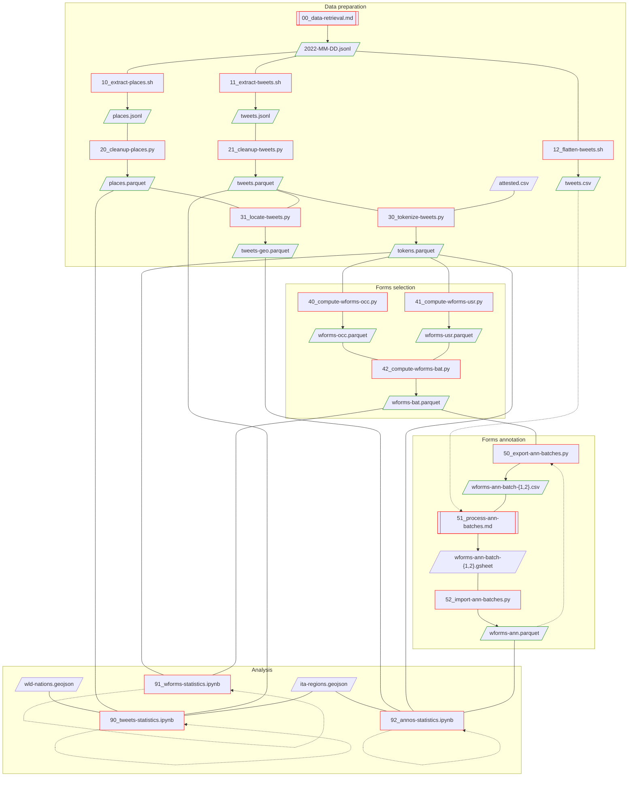

# breviloquia-italica

```mermaid
flowchart TD;

attested.csv[/attested.csv/]:::extdata;
ita-regions.geojson[/ita-regions.geojson/]:::extdata
wld-nations.geojson[/wld-nations.geojson/]:::extdata

subgraph "Data preparation"

00[[00_data-retrieval.md]]:::code;
00 --> 2022-MM-DD.jsonl[/2022-MM-DD.jsonl/]:::data;

10[10_extract-places.sh]:::code;
11[11_extract-tweets.sh]:::code;
12[12_flatten-tweets.sh]:::code;
2022-MM-DD.jsonl --- 10 --> places.jsonl[/places.jsonl/]:::data;
2022-MM-DD.jsonl --- 11 --> tweets.jsonl[/tweets.jsonl/]:::data;
2022-MM-DD.jsonl --- 12 --> tweets.csv[/tweets.csv/]:::data;

20[20_cleanup-places.py]:::code;
21[21_cleanup-tweets.py]:::code;
places.jsonl --- 20 --> places.parquet[/places.parquet/]:::data;
tweets.jsonl --- 21 --> tweets.parquet[/tweets.parquet/]:::data;

30[30_tokenize-tweets.py]:::code;
tweets.parquet --- 30;
attested.csv --- 30;
30 --> tokens.parquet[/tokens.parquet/]:::data;

31[31_locate-tweets.py]:::code;
places.parquet --- 31;
tweets.parquet --- 31 --> tweets-geo.parquet[/tweets-geo.parquet/]:::data;

end

subgraph "Forms selection"

40[40_compute-wforms-occ.py]:::code;
tokens.parquet --- 40 --> wforms-occ.parquet[/wforms-occ.parquet/]:::data;

41[41_compute-wforms-usr.py]:::code;
tokens.parquet --- 41 --> wforms-usr.parquet[/wforms-usr.parquet/]:::data;

42[42_compute-wforms-bat.py]:::code;
wforms-occ.parquet --- 42;
wforms-usr.parquet --- 42;
42 --> wforms-bat.parquet[/wforms-bat.parquet/]:::data;

end

subgraph "Forms annotation"

50[50_export-ann-batches.py]:::code;
wforms-bat.parquet --- 50 --> wforms-ann-batch-N.csv[/"wforms-ann-batch-{1,2}.csv"/]:::data;

51[[51_process-ann-batches.md]]:::code;
tweets.csv -.........-> 51;
wforms-ann-batch-N.csv --- 51 --> wforms-ann-batch-N.gsheet[/"wforms-ann-batch-{1,2}.gsheet"/]:::extdata;
wforms-ann.parquet -.-> 50;

52[52_import-ann-batches.py]:::code;
wforms-ann-batch-N.gsheet --- 52 --> wforms-ann.parquet[/wforms-ann.parquet/]:::data;

end

subgraph "Analysis"

90[90_tweets-statistics.ipynb]:::code;
wld-nations.geojson --- 90;
places.parquet --- 90;
tweets.parquet --- 90;
ita-regions.geojson --- 90;
90 -.-> 90;

91[91_wforms-statistics.ipynb]:::code;
tokens.parquet -------------- 91;
wforms-bat.parquet ---- 91;
91 -.-> 91;

92[92_annos-statistics.ipynb]:::code;
ita-regions.geojson --- 92;
tweets-geo.parquet --- 92;
tokens.parquet --- 92;
wforms-ann.parquet ---- 92;
92 -.-> 92;

end

classDef code stroke:red;
classDef data stroke:green,shape:rectangle;
classDef extdata shape:rectangle;
```

---
