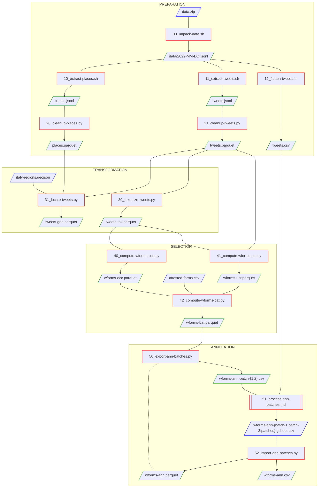
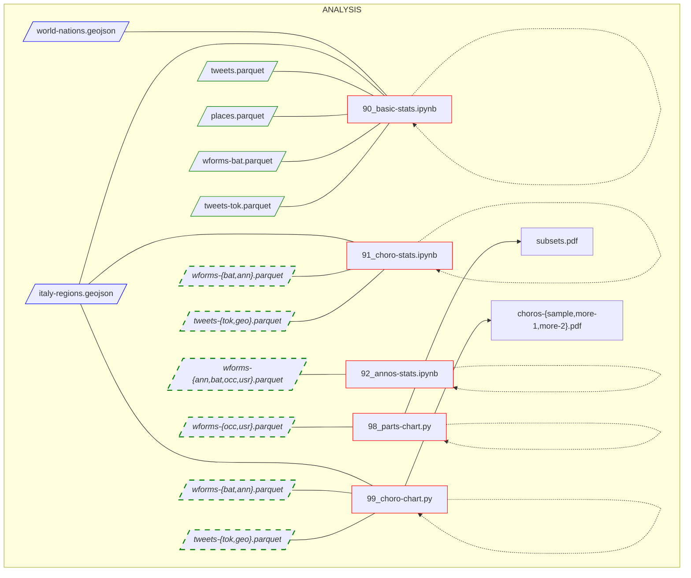

# Breviloquia Italica: data pipeline

This resource contains the full sourcecode for the data pipeline of the [Breviloquia Italica](https://github.com/breviloquia-italica) project.

## General structure

## Authors

Paolo Brasolin.

## License

This work is openly licensed via [CC BY 4.0](https://creativecommons.org/licenses/by/4.0/).
